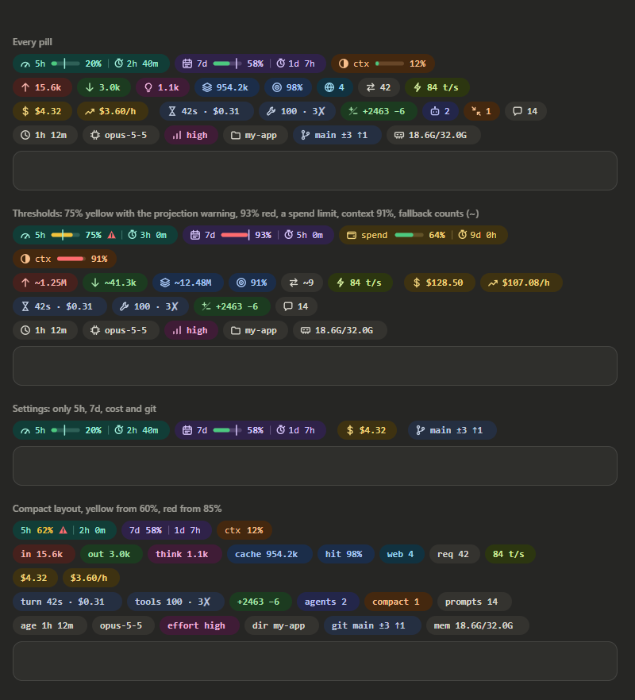
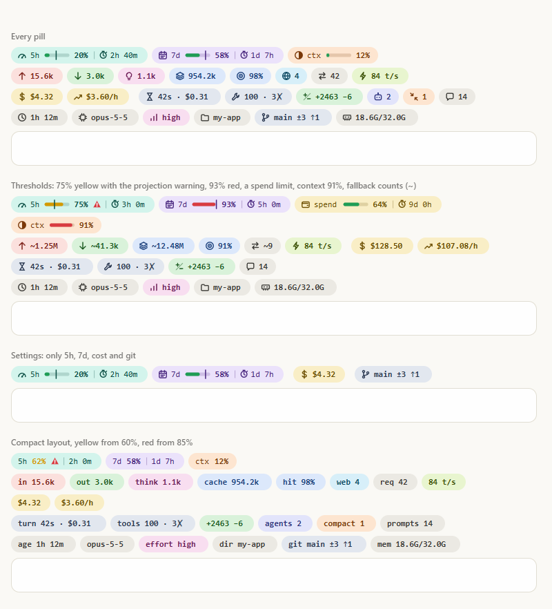

# claude-usage-band

A [Claude Code](https://claude.com/claude-code) mod that puts a usage band right above the prompt, in the desktop app's Code tab and in the terminal. It shows your 5-hour and 7-day limits with time to reset, how full the context is, token totals, cost, speed, the last turn, tool calls, git state and more. Each pill can be switched on or off.



<details>
<summary>Light theme</summary>



</details>

Hover any pill for its breakdown: input split into uncached and cache writes (with the 1-hour/5-minute TTL split), how much of the context each category fills, the most used tools, and where your pace puts a limit at reset.

---

## ⚡ Sponsored by WrongStack

<div align="center">

### _Built on the wrong stack. Shipped anyway._

**[WrongStack](https://wrongstack.com)** is a free, [open-source](https://github.com/WrongStack/WrongStack) AI coding agent with a Brain, a Memory, and a full toolbox. It reads your code, edits files, runs commands, and coordinates specialist agents — across six surfaces, from a plain terminal REPL to a cross-machine HQ dashboard. No subscription required, and you keep your hand on every permission.

[](https://wrongstack.com)
&nbsp;
[](https://github.com/WrongStack/WrongStack)
&nbsp;
[](https://github.com/WrongStack/WrongStack/stargazers)

```bash
curl -fsSL https://wrongstack.com/install.sh | sh   # macOS / Linux — self-contained binary
irm https://wrongstack.com/install.ps1 | iex        # Windows (PowerShell) — no Node.js needed
```

</div>

| | What you get |
|---|---|
| 🌐 **[200+ LLM providers](https://wrongstack.com)** | Catalog pulled live from models.dev — Anthropic, OpenAI, Google, plus OAuth sign-in for Claude Pro/Max, ChatGPT and Copilot, and any OpenAI-compatible endpoint (Ollama, vLLM, LM Studio) |
| 🛠️ **[67 built-in tools](https://github.com/WrongStack/WrongStack)** | Edits, lint/typecheck/test, execution, git, web, browser/E2E and a SQLite codebase index — every call gated by per-tool permissions |
| 🧠 **[SAGE memory](https://github.com/WrongStack/WrongStack/blob/main/docs/sage/ARCHITECTURE.md)** | Project-wide long-term memory in SQLite/FTS5, anchored to files, symbols and commits — it gets better at *your* codebase over time |
| 🖥️ **[Six surfaces](https://wrongstack.com)** | Readline REPL · Ink/React TUI (`--tui`) · WebUI · SimpleUI · Desktop · cross-machine HQ (`--hq`) |
| 🤖 **[Fleet orchestration](https://github.com/WrongStack/WrongStack/blob/main/docs/director-architecture.md)** | A Director fans out specialist subagents over a project mailbox; `eternal` & `parallel` goal loops run until the contract verifies |
| 🔍 **[Chimera & Kanban](https://wrongstack.com)** | Auto-review agents that critique your diffs with severity-ranked findings, plus durable Kanban boards with atomic verification |
| 🔐 **[Secure by default](https://github.com/WrongStack/WrongStack/blob/main/SECURITY.md)** | Encrypted secrets at rest, project-root containment, opt-in YOLO mode — MIT licensed, TypeScript-strict |

> **📊 The perfect pairing:** This band tells you exactly where your Claude limits stand — and **WrongStack** keeps you moving when they close in. It reads plan windows for Claude, ChatGPT, Copilot, Z.AI and more right in its own statusline and quota page, and when one provider runs dry, **fallback chains** rotate you onto the next model automatically. Watch the band, dodge the wall.

<div align="center">

🔗 **[wrongstack.com](https://wrongstack.com)** &nbsp;·&nbsp; **[github.com/WrongStack/WrongStack](https://github.com/WrongStack/WrongStack)** &nbsp;·&nbsp; ⭐ **[Star it on GitHub](https://github.com/WrongStack/WrongStack/stargazers)**

</div>

---

## Install

You need Claude Code 2.1.286 or newer (mods are early access) and Node 18.3 or newer.

```bash
git clone https://github.com/ersinkoc/claude-usage-band.git
cd claude-usage-band
node install.mjs
```

Then start a new session, or restart the desktop app. The band appears after the first model response, once the limits have a reading.

`install.mjs` copies the mod to `~/.claude/mods/usage-band` and adds two entries to the `env` block of `~/.claude/settings.json`. It honors `CLAUDE_CONFIG_DIR` if you set it, and it backs up `settings.json` and leaves every other setting alone:

```json
{
  "env": {
    "CLAUDE_CODE_PLUGIN_DIRS": "/home/you/.claude/mods/usage-band",
    "CLAUDE_CODE_ENABLE_FUNCTION_HOOKS": "1"
  }
}
```

If `CLAUDE_CODE_PLUGIN_DIRS` already lists other folders, they are kept. Entries are separated by `:` on macOS and Linux and by `;` on Windows.

| Command | What it does |
| --- | --- |
| `node install.mjs` | Copy and register (run it again after `git pull` to update) |
| `node install.mjs --link` | Register this folder itself instead of a copy, so your edits apply live |
| `node install.mjs --uninstall` | Unregister and remove the copy |
| `node install.mjs --dry-run` | Show what would change without changing anything |

To try it without installing, run a single session with `claude --plugin-dir /path/to/claude-usage-band`.

## Commands

| Command | What it does |
| --- | --- |
| `/usage-band` | Refresh everything and print a one-line summary |
| `/usage-band settings` | Open a settings pane with a checkbox for each pill (this works in the desktop app, which has no `/config`) |
| `/usage-band on git, cost-rate` | Turn pills on; `off` turns them off. Names are loose: `git`, `showGit` and `Git branch` all match |
| `/usage-band set layout compact` | Also `set yellow 60`, `set red 85`, `set refresh 60` |
| `/usage-band hide` / `show` | Hide or show the whole band (remembered across sessions) |

> Running it headless from Git Bash on Windows? Git Bash turns `/usage-band` into a Windows path. Use `MSYS_NO_PATHCONV=1 claude -p "/usage-band"`, or run it from PowerShell.

## Settings

Settings are stored in `settings.json` under `pluginConfigs`. They also appear in `/config` in a terminal session. Every pill is on by default.

| Setting | Shows |
| --- | --- |
| `show5h` | 5-hour limit: usage of the 5-hour rate-limit window and time to reset |
| `show7d` | 7-day limit: usage of the 7-day rate-limit window and time to reset |
| `showSpendLimit` | Spend limit: a gateway's spend limit, when the account reports one |
| `showContext` | Context window: how full the context window is |
| `showInput` | Input tokens: uncached input plus cache writes |
| `showOutput` | Output tokens: tokens the model generated |
| `showThinking` | Thinking tokens: the part of output spent on extended thinking |
| `showCacheRead` | Cache read tokens: input tokens served from the prompt cache |
| `showCacheHit` | Cache hit rate: share of all input read from the prompt cache |
| `showWeb` | Web searches and fetches: server-side web search and fetch requests |
| `showRequests` | API requests: model requests, subagents included |
| `showSpeed` | Output speed: tokens per second of the last response (hover for the average) |
| `showCost` | Session cost: session cost at API list prices |
| `showCostRate` | Cost per hour: average spend per hour since the session started |
| `showLastTurn` | Last turn: duration, cost and output speed of the last turn |
| `showTools` | Tool calls: tool calls, failures and the most used tools |
| `showChurn` | Lines changed: lines added and removed by Edit, MultiEdit and Write |
| `showAgents` | Running subagents: subagents running right now |
| `showCompactions` | Compactions: how often the context was compacted and what it freed |
| `showPrompts` | Prompts: prompts sent this session |
| `showSessionAge` | Session age: time since the session started |
| `showModel` | Model: the model that answered last, and the Claude Code version |
| `showEffort` | Thinking effort: the thinking effort of the last request (low to max) |
| `showFolder` | Folder: the working directory's name (hover for the full path) |
| `showGit` | Git branch: branch, uncommitted files, ahead and behind |
| `showMemory` | Machine memory: this machine's memory in use |

| Option | Default | What it does |
| --- | --- | --- |
| `limitProjection` | on | Project 5h/7d usage at reset from the pace so far, and warn when it would pass 100% |
| `contextBreakdown` | on | List what fills the context in the context tooltip (estimated locally) |
| `alerts` | on | Show a toast when a limit crosses the yellow or red threshold |
| `showInTerminal` | on | Turn off to show the band only in the desktop app |
| `layout` | `full` | `compact` drops icons and bars and labels each value instead |
| `warnAt` / `hotAt` | 70 / 90 | The percentages at which bars turn yellow and red |
| `refreshSeconds` | 30 | How often countdowns and totals refresh (10 to 600) |

## How it works

- **Limits, context and cost** come from the engine (`$.session.usage()`, and the `session.measure` event after every turn). The limit pills stay hidden until the first model response, because only then are the limits known. The bar turns yellow and red at your thresholds. The vertical line marks how much of the window has passed.
- **Token totals, tool calls and lines changed** are not in the API, so `scripts/tokens.mjs` reads the session's transcript (`~/.claude/projects/*/<session>.jsonl`, plus its subagents' files). The transcript writes a message once per content block, so rows are de-duplicated by message id and request id. The script runs again only when the transcript's size or modification time changes. If Node can't run it, the token pills fall back to summing each turn's usage and show a `~`.
- **Speed, model and effort** come from each streamed response. **Last turn, running subagents and compactions** come from engine events.
- **Cost** is at API list prices. On a subscription, that is not what you pay.

In the desktop app each pill is an SVG with a `<title>` tooltip that follows the light or dark theme. In the terminal the band is colored text, with `█░` bars and a `│` for elapsed time.

## Development

```bash
node install.mjs --link   # load this folder in every new session; edits reload live
npm test                  # claude plugin test .  (10 tests, terminal and desktop)
npm run validate          # claude plugin validate .
npm run typecheck         # needs the API types: run /plugin-types once in a session here
npm run preview           # docs/preview.html: every pill, both themes (Node 22.18+)
npm run manifest          # regenerate plugin.json's settings from hooks/pills.ts
```

| Path | What it is |
| --- | --- |
| `.claude-plugin/plugin.json` | Manifest and settings (`userConfig`) |
| `hooks/register.tsx` | The hooks: data, commands, settings pane, and drawing for each surface |
| `hooks/pills.ts` | The pill model and desktop SVG drawing, with no engine calls (shared with the preview) |
| `types/index.d.ts` | The `$.state` contract |
| `scripts/` | `tokens.mjs` (transcript totals) and `sysinfo.mjs` (memory) |
| `tests/` | `claude plugin test` suite |

## License

[MIT](LICENSE)
